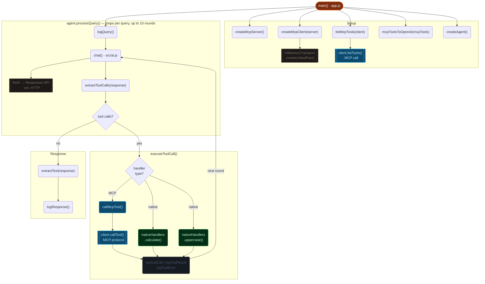

```mermaid
flowchart TD

    MAIN(["main()  ·  app.js"]):::entry

    subgraph SETUP ["  Setup  "]
        CMS("createMcpServer()")
        CMC("createMcpClient(server)")
        IMP[["InMemoryTransport\n.createLinkedPair()"]]
        LMT("listMcpTools(client)")
        CLT[["client.listTools()\n· MCP call"]]
        MTO("mcpToolsToOpenAI(mcpTools)")
        CA("createAgent()")
    end

    subgraph LOOP ["  agent.processQuery()  —  loops per query, up to 10 rounds  "]
        LQ("logQuery()")
        CHAT("chat()  ·  src/ai.js")
        API[["fetch  →  Responses API\n· ext. HTTP"]]
        ETC("extractToolCalls(response)")
        DEC{"tool calls?"}
    end

    subgraph EXEC ["  executeToolCall()  "]
        HT{"handler\ntype?"}
        CMCT("callMcpTool()")
        CTL[["client.callTool()\n· MCP protocol"]]
        NATC("nativeHandlers\n.calculate()")
        NATU("nativeHandlers\n.uppercase()")
        TLOG("logToolCall / logToolResult\nlogToolError")
    end

    subgraph RESP ["  Response  "]
        ETX("extractText(response)")
        LRE("logResponse()")
    end

    MAIN --> CMS
    MAIN --> CMC --> IMP
    MAIN --> LMT --> CLT
    MAIN --> MTO
    MAIN --> CA
    MAIN --> LQ

    LQ --> CHAT --> API
    CHAT --> ETC --> DEC

    DEC -->|"yes"| HT
    DEC -->|"no"| ETX

    HT -->|"MCP"| CMCT --> CTL --> TLOG
    HT -->|"native"| NATC --> TLOG
    HT -->|"native"| NATU --> TLOG
    TLOG -->|"next round"| CHAT

    ETX --> LRE

    classDef entry   fill:#7c2d12,stroke:#f97316,color:#fff
    classDef mcp     fill:#0c4a6e,stroke:#38bdf8,color:#bae6fd
    classDef native  fill:#052e16,stroke:#4ade80,color:#bbf7d0
    classDef ext     fill:#1c1917,stroke:#57534e,color:#78716c,stroke-dasharray:5 3
    classDef dim     fill:#161b22,stroke:#30363d,color:#4a5568

    class MAIN entry
    class CMCT,CTL,CLT mcp
    class NATC,NATU native
    class API,IMP ext
    class TLOG dim
```
